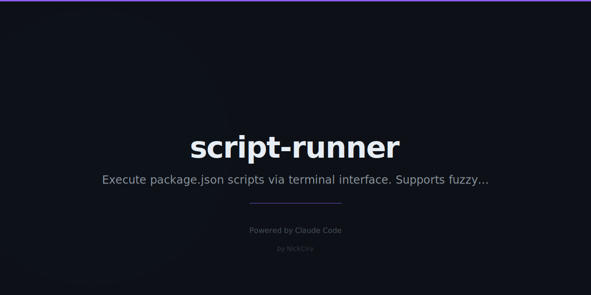

# script-runner

Beautiful interactive TUI for `package.json` scripts. Arrow keys, fuzzy search, parallel runs, run history.

Works with **npm**, **bun**, **pnpm**, and **yarn** — auto-detects from lockfiles.

Zero external dependencies. Node 18+. Pure ES modules.

---

## Quick start

```bash
npx script-runner
```

Or install globally:

```bash
npm install -g script-runner
sr
```

---

## Interactive menu

```
📦 Script Runner — my-app
─────────────────────────────────────────────────────
Package manager: bun | 8 scripts found

  > ● dev          "bun run next dev"              ✅ 2h ago  (1.2s)
      build        "bun run next build"            ✅ 1d ago  (45s)
      test         "jest --watchAll"               ❌ 3d ago  (12s, FAILED)
      lint         "eslint src/"                   ✅ 5h ago  (3s)
      type-check   "tsc --noEmit"                  ✅ 2h ago  (8s)
      format       "prettier --write ."            ✅ 1d ago  (2s)
      db:migrate   "prisma migrate dev"            —  never run
      deploy       "wrangler pages deploy dist"    ✅ 3d ago  (28s)

  ↑↓ navigate | Enter run | Space select | / search | R re-run | Q quit
```

---

## Keybindings

| Key | Action |
|-----|--------|
| `↑` / `↓` | Navigate scripts |
| `Enter` | Run selected script (or all selected if Space was used) |
| `Space` | Toggle selection for parallel run |
| `/` | Start fuzzy search |
| `Esc` | Exit search |
| `R` | Re-run last script |
| `Q` | Quit |
| `Ctrl+C` | Exit |

---

## CLI flags

```bash
# Run a specific script directly
npx script-runner dev

# Run multiple scripts sequentially
npx script-runner build test

# Run multiple scripts in PARALLEL
npx script-runner -p dev test

# List all scripts with run history
npx script-runner --list

# Show run history (last 30 entries)
npx script-runner --history

# Show stats (run count, success rate, avg duration)
npx script-runner --stats
```

---

## Parallel execution output

```
Running 2 scripts in parallel...

[dev   ] Starting Next.js dev server...
[test  ] Running test suite...
[dev   ] Server started on :3000
[test  ] 2 tests failed
[test  ] FAIL src/auth.test.js

────────────────────────────────────────────────────────────
[dev  ] DONE    (3.2s)
[test ] FAILED  (exit 1, 12.3s)
```

---

## Package manager detection

Lockfile priority:

1. `bun.lockb` → **bun**
2. `pnpm-lock.yaml` → **pnpm**
3. `yarn.lock` → **yarn**
4. `package-lock.json` → **npm**
5. Default → **npm**

---

## Run history

Metadata is stored at `~/.script-runner-{project-name}.json`. Tracked per script:

- Last run timestamp
- Last run duration
- Last exit code (success / fail)
- Total run count
- Last 20 run entries (for stats)

---

## License

MIT
