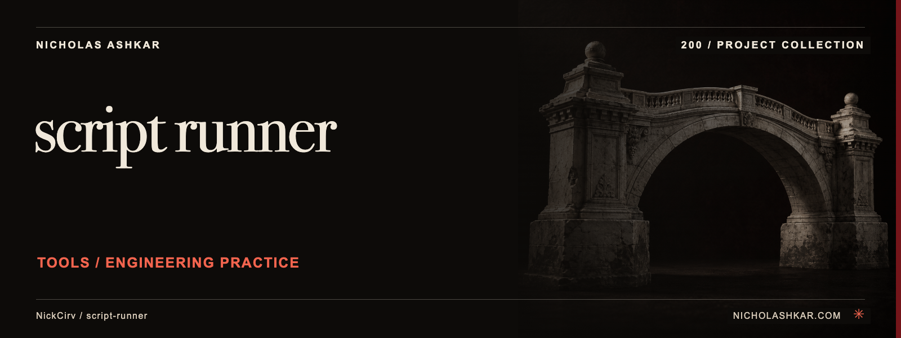

# script-runner

Browse and run a project’s package.json scripts from a terminal interface.

Detects a package manager from known lockfiles, supports direct/sequential/parallel runs and records local run history.


<a id="install"></a>

## Quickstart

Package runtime requirement: Node.js `>=20`. Git is needed to obtain this pinned source checkout.

```bash
git clone https://github.com/NickCirv/script-runner.git
cd script-runner
git checkout a25978d34119438761036d93eaeb1c9d60ed3b90
node index.js --list
```

This source-derived example has not been executed in this review. The command lists scripts declared in this checkout without running them.


<a id="flags"></a>

<a id="keybindings-interactive-mode"></a>

<a id="parallel-execution"></a>

<a id="package-manager-detection"></a>

<a id="run-history"></a>

## Usage

```bash
node /path/to/script-runner/index.js --list
node /path/to/script-runner/index.js test
node /path/to/script-runner/index.js lint test
node /path/to/script-runner/index.js lint test --parallel
```

Run from the target package directory. `--history` (`-h`) and `--stats` show locally stored metadata; no arguments opens the interactive interface.

[Command reference](docs/REFERENCE.md) covers arguments, modes and output controls.


<a id="what-it-is-not"></a>

## Behavior and limits

Selected scripts execute with the user’s normal permissions and can perform arbitrary project-defined work. History is stored under a home-directory filename based on package name, so same-name projects can share records. Lockfile detection is a heuristic and only recognizes the coded filenames, including bun.lockb. `-h` means history, not help.

## Development

Declared package scripts:

| Script | Command |
| --- | --- |
| `test` | `node --test` |

The smoke test syntax-checks the entrypoint; it does not exercise CLI behavior or integrations.

## Research

[Source review and claim ledger](docs/RESEARCH.md) records revision `a25978d34119`, inspected files and verification gaps.

## License and attribution

Protected license and attribution files remain unchanged: [LICENSE](https://github.com/NickCirv/script-runner/blob/a25978d34119438761036d93eaeb1c9d60ed3b90/LICENSE).

[Artwork credits](assets/nicholas-ashkar/CREDITS.md) · [Nicholas Ashkar — consulting](https://nicholashkar.com/#oxblood-contact)
