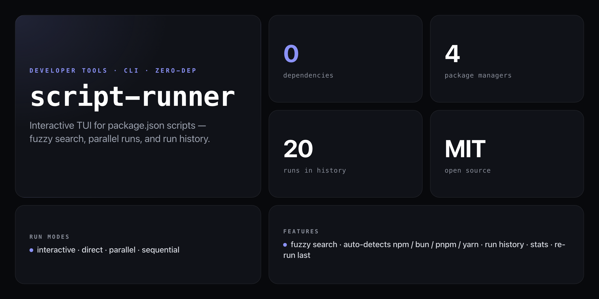

<div align="center">

**Navigate, search, and launch your package.json scripts from an interactive terminal UI — without memorising every command.**


</div>

---

Most projects accumulate a graveyard of `package.json` scripts that nobody runs because nobody remembers what they are. `script-runner` replaces that with an arrow-key menu, fuzzy search, parallel execution, and a persistent run history — zero dependencies, zero install.

```
📦 Script Runner — my-app
─────────────────────────────────────────────────────────────
Package manager: bun | 8 scripts found

  > ● dev          "bun run next dev"           ✅ 2h ago  (1.2s)
      build        "bun run next build"         ✅ 1d ago  (45s)
      test         "jest --watchAll"             ❌ 3d ago  (12s, FAILED)
      lint         "eslint src/"                ✅ 5h ago  (3s)
      type-check   "tsc --noEmit"               ✅ 2h ago  (8s)
      format       "prettier --write ."         ✅ 1d ago  (2s)
      db:migrate   "prisma migrate dev"         —  never run
      deploy       "wrangler pages deploy dist" ✅ 3d ago  (28s)

  ↑↓ navigate | Enter run | Space select | / search | R re-run | Q quit
```

## Install

No install, no npm account — run straight from GitHub with zero dependencies:

```bash
npx github:NickCirv/script-runner
```

Or use the short alias `sr` after a global install:

```bash
npm install -g github:NickCirv/script-runner
sr
```

## Usage

```bash
# interactive TUI (default)
npx github:NickCirv/script-runner

# run a specific script directly
npx github:NickCirv/script-runner dev

# run multiple scripts sequentially
npx github:NickCirv/script-runner build test

# run multiple scripts in parallel
npx github:NickCirv/script-runner -p lint type-check test

# list all scripts with last-run status
npx github:NickCirv/script-runner --list

# show run history (last 30 entries)
npx github:NickCirv/script-runner --history

# show stats — run count, success rate, avg duration
npx github:NickCirv/script-runner --stats
```

## Flags

| Flag | Alias | Description |
|------|-------|-------------|
| `--list` | `-l` | List all scripts with last-run status and duration |
| `--history` | `-h` | Show the 30 most recent runs across all scripts |
| `--stats` | `-s` | Show run count, success rate, and average duration per script |
| `--parallel` | `-p` | Run the named scripts in parallel (use with explicit script names) |

## Keybindings (interactive mode)

| Key | Action |
|-----|--------|
| `↑` / `↓` | Navigate the script list |
| `Enter` | Run the highlighted script |
| `Space` | Toggle a script for parallel selection |
| `Enter` (after Space) | Run all selected scripts in parallel |
| `/` | Start fuzzy search — narrows the list as you type |
| `Esc` | Exit search, return full list |
| `R` | Re-run the last script |
| `Q` | Quit |
| `Ctrl+C` | Exit immediately |

## Parallel execution

Select multiple scripts with `Space`, then `Enter` to run them all at once. Output is prefixed by script name so you can tell streams apart:

```
Running 2 scripts in parallel...

[dev   ] Starting Next.js dev server...
[test  ] Running test suite...
[dev   ] Server started on :3000
[test  ] 2 tests failed

────────────────────────────────────────────────────────────
[dev  ] DONE    (3.2s)
[test ] FAILED  (exit 1, 12.3s)
```

## Package manager detection

Detected from lockfiles — no config needed:

| Lockfile | Package manager used |
|----------|---------------------|
| `bun.lockb` | bun |
| `pnpm-lock.yaml` | pnpm |
| `yarn.lock` | yarn |
| `package-lock.json` | npm |
| (none found) | npm |

## Run history

Every run is recorded to `~/.script-runner-{project-name}.json`. Per script:

- Last run timestamp and duration
- Last exit code (shown as ✅ / ❌)
- Total run count
- Last 20 individual runs (used for stats)

## What it is NOT

- **Not a task runner or build tool.** It executes the scripts already defined in your `package.json` — it doesn't define, chain, or transform them.
- **Not a CI tool.** It is designed for local interactive use. For non-TTY environments (CI pipelines), it automatically falls back to `--list` output.
- **Not a replacement for your package manager.** It calls `npm run`, `bun run`, `pnpm run`, or `yarn run` under the hood — all existing behaviour is preserved.

---

<div align="center">
<sub>Zero dependencies · Node 18+ · MIT · by <a href="https://github.com/NickCirv">NickCirv</a></sub>
</div>
